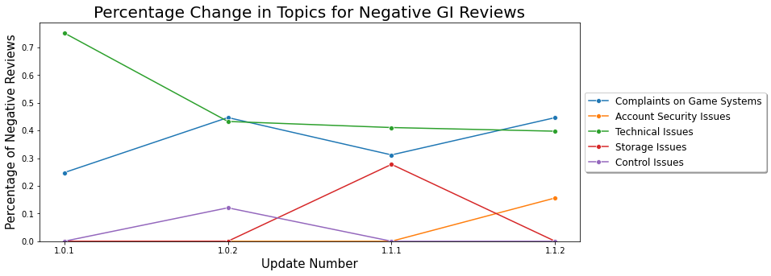

# Analysis of Genshin Impact Reviews
## Problem Statement
This projects will examine the reviews of Genshin Impact from both the Google Play store and Apple App store.

**What is Genshin Impact?**

The two main characteristic of Genshin Impact are:
1. Massive Open World Action RPG
2. Free-to-Play Gacha Game

The game was released on PC(Windows), PlayStation 4, Android and iOS on September 28, 2020. The game was very well-received after its release, obtaining very favorable receptions and  over 17 million downloads in the first week. The popularity of the game can be seen from the fact that, in the first two months, the game generated close to US\\$400 million. In contrast, according to miHoYo co-founder Liu Wei, Genshin Impact has a development and marketing budget of more than US$100 million.

Aside from that, the game was awarded both App Store's "iPhone Game of the Year" and Google Play's "Best Game of 2020", this shows the popularity of the game despite being released in the last quarter of 2020.

### Aim of Project
The aim of this project is to:
1. Create a model that **categorizes the reviews into different categories** for various teams to handle (i.e. Technical team, development team, etc)
2. Create a model that **classifies reviews based on its sentiment**, this will be useful to sort through non-rated reviews, such as reviews, feedbacks and suggestions from other channels.

In order to achieve the aims specified above, I will:
1. **Train multiple topic modeling models** and examine the **coherence score and representative text** to ensure that the **topics are well defined** and suitable for the purpose
2. **Test different sentiment analysis tools and classification models** to classify the reviews. I will use appropriate metrics to evaluate the performance of the models (such as Accuracy, F1-score, etc).

With the above information, I will analyze how the topics raised by users

## Data Information
This projects makes use of two datasets scrapped from Google Play Store and Apple App Store (US store for both datasets).

1. The dataset from **Google Play Store contains 102,582 reviews**.
2. The dataset from **Apple App Store contains 11,617 reviews**.

Both datasets have already been **combined to form one final dataset** that will be used from this notebook onwards. Below is the data dictionary of the combined dataset.

**Data Dictionary**

|Feature|Type|Description|
|---|---|---|
|content|object|The text of the review|
|score|int64|The rating with the review|
|date|datetime64|The date and time the review was posted|
|thumbsUp|float64|The number of people who gave "Thumbs Up" for the review*|
|source|object|Which App Store the review originated||

*thumbsUp is only applicable for reviews from Google Play Store

# Findings & Conclusion

## 1. LDA Model

For the LDA Model, I split the dataset by the update version and positive and negative class. Below, the topics trends in the reviews can be examined.

### Positive Reviews Trend

- In general, there are a lot of reviews that are just expressing how much the reviewer enjoyed the game. However, such reviews saw a significant dip in update 1.1.2.
- There is a constant amount of reviews on technical issues.
- In the first update, there is a significant amount of reviews that is just praising the game for a job well done, or writing how they had waited for the game and is playing the game a lot.

### Negative Reviews Trend

- Throughout the different updates, there are topics on technical issues and complaints on game systems.
- For technical issues, the percentage was especially high for update 1.0.1. This signals that when the game was first released, there were a lot of technical issues (crashes, white/black screen) for a lot of players. The percentage then decreased to about 40%.
- For complaints on game system, most of the complaints are on the character systems and gatcha rate. There are also some complaints on the resin system. In update 1.1.2, the keyword "Zhongli" appeared. Zhongli is a 5 stars character is the game, and this showss that there is a significant number of players who are unhappy with how Zhongli turned out. He has since been planned to be made stronger by the Mihoyo.
- In 1.0.2, controller issue was picked up as a topic. This could be because people after playing the game for a while, realizing that the controls on mobile phone was not very ideal.
- In 1.1.1, there is a topic on storage issue. This is because of the first major update, which needed a 6gb update, resulting in a lot of negative reviewss from players.
- In 1.1.2, there is a new topic on account security issue. A lot of players are writing that their accounts have been hacked and stolen. Mihoyo had also made an announcement on this issue.

## 2. Sentiment Analysis Model

After trying multiple models, different combination of classes (due to the data imbalance) and optimizing the LSTM model. The final sentiment analysis model (using LSTM) obtained an accuracy of 90.49% and F1-score of 72.97.

The inability to achieve higher accuracy could be due to the subjectivity of the reviews themselves. For example, a review of rating = 4, could have similar content to a review of rating = 2 or even 1. The score is a subjective number given by the reviewer, and this could introduce noise into the dataset.

To overcome this issue, a few things could be tried:
1. Gather more data to train on. This can allow the data to be more generalized, reducing some effect of subjectivity.
2. Trying more complex models such as GloVe embedding or BERT Classification.

## Final Model Prediction on New Review
The following new review is passed through the models.

### 1. New Review
"The game is truly one of the best in it's genre. the world is fun to explore, the combat is quite engaging!
The biggest issue, I have with this game is the resin system! It feels too restrictive, and heavily halts the players progression in becoming stronger and upgrading their characters. All the fun content requires you to have resin, and there's not enough ways to refill resin reasonably. I often end my play sessions unsatisfied because I just wanted to play and farm a bit more"

The models predicted the following:
1. Neutral class, with 51.67% of being positive
2. Topics: Character system and Suggestions (the topic modeling will predict 2 topics if the probability are close)

I then tried splitting the review (which is quite neutral) into the positive portion and negative portion, and ran it through the models.

### 2. Positive Portion of New Review
"The game is truly one of the best in it's genre. the world is fun to explore, the combat is quite engaging!"

The models predicted the following:
1. Positive class, with 99.94% of being positive
2. Topics: Love for Game

### 3. Negative Portion of New Review
"The biggest issue, I have with this game is the resin system! It feels too restrictive, and heavily halts the players progression in becoming stronger and upgrading their characters. All the fun content requires you to have resin, and there's not enough ways to refill resin reasonably. I often end my play sessions unsatisfied because I just wanted to play and farm a bit more"

The models predicted the following:
1. Negative class, with 10.33% of being positive
2. Topics: Complaints on Game System
